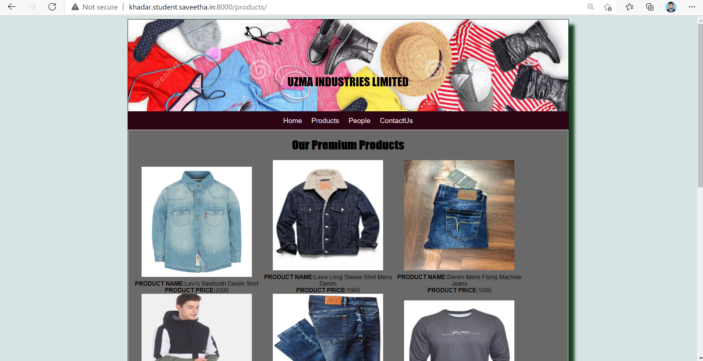
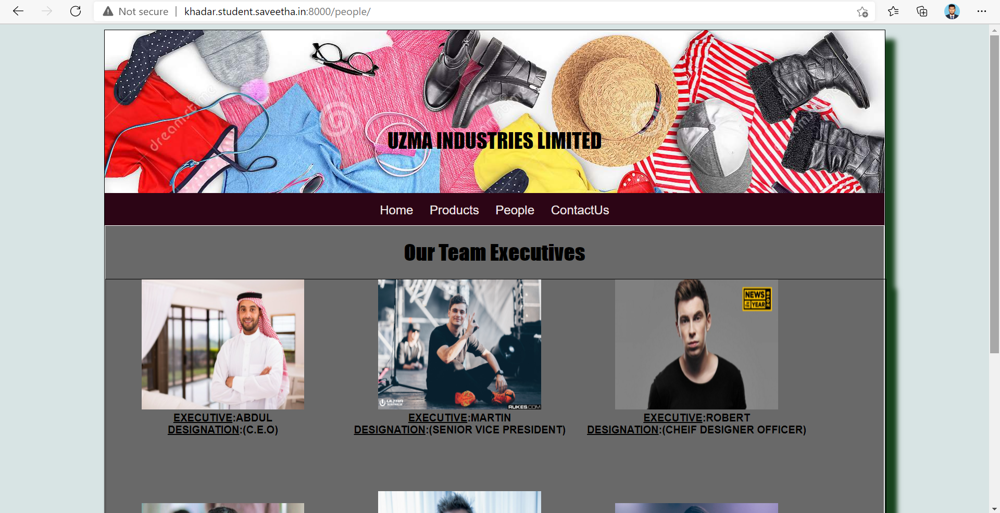

# Web Design for a Manufacturing Company
## AIM: 
To design a static website for a clothes manufacturing company.

## DESIGN STEPS:
### Step 1: 
Requirement collection.
### Step 2:
Creating the layout using HTML and CSS.
### Step 3:
Updating the sample content.
### Step 4:
Choose the appropriate style and color scheme.
### Step 5:
Validate the layout in various browsers.
### Step 6:
Validate the HTML code.
### Step 6:
Publish the website in the given URL.

## PROGRAM:

### base.html
```

<!DOCTYPE html>
<html lang="en">

<head>
    <title>Uzma industries Limited </title>
    <link rel="stylesheet" href="">
    <link rel="icon" href="" type="image/x-icon">

</head>

<body>
    <div class="container">
        <div class="banner">
            UZMA INDUSTRIES LIMITED
        </div>
        <div class="menu">
            <div class="menuitem"><a href="/home">Home</a></div>
            <div class="menuitem"><a href="/products">Products</a></div>
            <div class="menuitem"><a href="/people">People</a></div>
            <div class="menuitem"><a href="/contactus">ContactUs</a></div>
        </div>
        <div class="content">
            
            
        </div>
        <div class="footer">
            Copyright © 2020 Uzma Industries Limited, Developed by Khadar basha.
        </div>
    </div>
</body>

</html>
```

### home.html
```



<div class="homecontent">
    <h1>About Us</h1>
    
    <div class="contenttext">
        Uzma manufacturing is a major industry. It is largely based on the conversion of fibre into yarn, yarn into
        fabric. These are then dyed or printed, fabricated into clothes which are then converted into useful goods such
        as clothing, household items, upholstery and various industrial products it summarizes the types of trade and
        industry along the production and life chain of clothing and garments, starting with the textile industry
        (producers of cotton, wool, fur, and synthetic fibre), embellishment using embroidery, via the fashion industry
        to apparel retailers up to trade with second-hand clothes and textile recycling. The producing sectors build
        upon a wealth of clothing technology some of which, like the loom, the cotton gin, and the sewing machine
        heralded industrialization not only of the previous textile manufacturing practices.Different types of fibres
        are used to produce yarn. Cotton remains the most important natural fibre, so is treated in depth. There are
        many variable processes available at the spinning and fabric-forming stages coupled with the complexities of the
        finishing and colouration processes to the production of a wide range of products.
     <ul>
        <li>Levi's</li>
        <li>Flying Machine</li>
        <li>Allen Solly </li>
        <li>Numero Uno</li>
        <li>Mufti</li>
        <li>Pepe Jeans</li>


        </ul>
    </div>
</div>

```
### products.html
```



<div class="productcontent">
    <h1>Our Premium Products</h1>
    <div class="productitems">
        <div class="productitem">
            <div class="itemimage">
                
            </div>
            <div class="itemname">Levi's Sawtooth Denim Shirt</div>
            <div class="itemprice">Price: Rs.2000.00 </div>
        </div>
        <div class="productitem">
            <div class="itemimage">
                
            </div>
            <div class="itemname">Levis Long Sleeve Shirt Mens Denim </div>
            <div class="itemprice">Price: Rs.1900.00 </div>
        </div>
        <div class="productitem">
            <div class="itemimage">
                
            </div>
            <div class="itemname">Denim Mens Flying Machine Jeans</div>
            <div class="itemprice">Price: Rs.1000.00</div>
        </div>
        <div class="productitem">
            <div class="itemimage">
                
            </div>
            <div class="itemname">Men Black Hooded Colour Blocked Casual Jacket</div>
            <div class="itemprice">Price: Rs.6000.00</div>
        </div>
        <div class="productitem">
            <div class="itemimage">
                
            </div>
            <div class="itemname">Flying Machine Men Casual Jeans</div>
            <div class="itemprice">Price: Rs.2000.00 </div>
        </div>
        <div class="productitem">
            <div class="itemimage">
                
            </div>
            <div class="itemname">Numero Uno Sweatshirt</div>
            <div class="itemprice">Price: Rs.1000.00 </div>
        </div>
        <div class="productitem">
            <div class="itemimage">
                
            </div>
            <div class="itemname">ECO-NEUTRAL Shirts</div>
            <div class="itemprice">Price: Rs.1500.00 </div>
        </div>
        <div class="productitem">
            <div class="itemimage">
                
            </div>
            <div class="itemname">Numero Uno Black Hoodie</div>
            <div class="itemprice">Price: Rs.1500.00 </div>
        </div>
        <div class="productitem">
            <div class="itemimage">
                
            </div>
            <div class="itemname">Numero Uno White And Black Collar Checked Casual Shirt</div>
            <div class="itemprice">Price: Rs.2000.00 </div>
        </div>
        <div class="productitem">
            <div class="itemimage">
                
            </div>
            <div class="itemname">Mufti brand t shirt...</div>
            <div class="itemprice">Price: Rs.1000.00 </div>
        </div>
        <div class="productitem">
            <div class="itemimage">
                
            </div>
            <div class="itemname">Surplus Mufti Shirts, Size: M-4XL</div>
            <div class="itemprice">Price: Rs.1200.00 </div>
        </div>
        <div class="productitem">
            <div class="itemimage">
                
            </div>
            <div class="itemname"> Black clue pepe jeans</div>
            <div class="itemprice">Price: Rs.1500.00 </div>
        </div>
    </div>
</div>

```
## people.html:
```



<div class="peoplecontent">
    <h1>OUR EXECUTIVE LEADERSHIP TEAM</h1>
</div>
<div class="peoplelists">
    <div class="peoplelist">
        <div class="peopleimage">
            
        </div>
        <div class="peoplename">
            <h2>ABDUL</h2>
        </div>
        <div class="peoplepost">
            <h3>(C.E.O)</h3>
        </div>
    </div>
    <div class="peoplelist">
        <div class="itemimage">
            
        </div>
        <div class="peoplename">
            <h2>MARTIN</h2>
        </div>
        <div class="peoplepost">
            <h3>(SENIOR VICE PRESIDENT)</h3>
        </div>
    </div>
    <div class="peoplelist">
        <div class="itemimage">
            
        </div>
        <div class="peoplename">
            <h2>ROBERT</h2>
        </div>
        <div class="peoplepost">
            <h3>(CHEIF DESIGNER OFFICER)</h3>
        </div>
    </div>
    <div class="peoplelist">
        <div class="itemimage">
            
        </div>
        <div class="itemname">
            <h2>FAZAL KHAN</h2>
        </div>
        <div class="itemprice">
            <h3>(CHEIF OPERATING OFFICER)</h3>
        </div>
    </div>
    <div class="peoplelist">
        <div class="itemimage">
            
        </div>
        <div class="peoplename">
            <h2>DAVID</h2>
        </div>
        <div class="peoplepost">
            <h3>(VICE PRESIDENT MARKETING)</h3>
        </div>
    </div>
    <div class="peoplelist">
        <div class="itemimage">
            
        </div>
        <div class="itemname">
            <h2>DAN</h2>
        </div>
        <div class="itemprice">
            <h3>(PRODUCTION SUPERVISOR)</h3>
        </div>
    </div>
</div>

```
## contactus.html:
```




<div class="content1">
    <h1 class="contactcenter">
        CONTACT US</h1>
    <h2 class="contactcenter">
        CONTACT ADDRESS:2nd industrial City, Al Kharj Road, Street No.: 175, 3rd Lane Zone D. Riyadh, Kingdom of Saudi Arabia | P.O. Box: 26862 | Riyadh: 11496, Saudi Arabia
        <br>
        EMAIL:uzamkhan87@gmail.com
        <br>
        MOBILE:+966568421579
    </h2>
</div>

```    

## OUTPUT:








## CODE VALIDATION REPORT:


## RESULT:
Thus a website is designed for the clothes manufacturing company and is hosted in the URL http://khadar.student.saveetha.in:8000/. HTML code is validated.